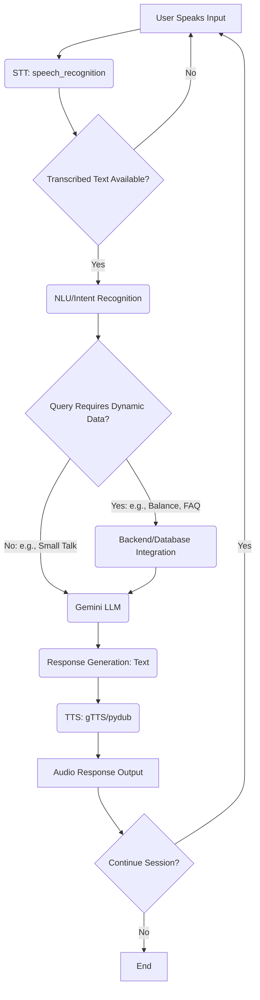

# **VocalNova**

This project is a fully interactive AI Voice Assistant built using **Streamlit**, **Google Gemini 2.5 Flash**, **speech-to-text**, and **text-to-speech**.  
You can talk to the assistant using your microphone or type your question.  
It responds with intelligent answers and can speak the reply aloud.  
A **STOP button** is also included so users can interrupt speech anytime. 🔊🛑

---

## ✨ Key Features & Architecture

The bot is built on a modular architecture, ensuring each component is focused and scalable. Here are the core features implemented:
### 1. Speech-to-Text Conversion (STT) - Hearing the User
* **Module:** `stt.py`
* **Tool:** `speech_recognition`
* **Function:** Captures audio input via the microphone and transcribes it into text.

### 2. Natural Language Understanding & Response Generation (NLU/Response) - The Brain
* **Module:** `nlp.py`
* **Tool:** **Google Gemini API** (`models/gemini-2.5-flash`)
* **Function:** The transcribed text is sent to the Gemini model to understand the user's intent and generate a contextual and dynamic textual reply.

### 3. Dynamic Response Generation (The Decision Layer)
* **Function:** This is the core logic module. It utilizes a **hybrid approach**:
    * **Rule-Based Logic:** Handles specific, predefined customer service intents (e.g., retrieving account details or handling simple commands).
    * **Generative AI (Gemini):** Used for open-ended or complex queries that require dynamic, creative, and contextual responses, ensuring a human-like conversation.

### 4. Integration with Backend/Database
* **Function:** Essential for utility, the bot connects to a database or backend system to perform dynamic actions. For this project, the **NLU layer is responsible for triggering data lookups** based on identified intent.
* **Example Use:** Fetching the user's account balance, checking order status, or updating a ticket.

### 5. Text-to-Speech Conversion (TTS)
This is the bot's **voice**, converting its textual reply back into an audio format.
*Function:** Converts the generated text response into high-quality speech output for the user. 

### 6. Analytics Dashboard
To ensure continuous improvement and monitoring, a basic analytics dashboard was developed to track performance metrics.

**Objective:** Track and display key metrics like user queries, response times, and error rates for performance improvement.
* **Implementation:** Developed using **Streamlit** to provide a live, visual representation of the bot's operational health.
* **Key Metrics Displayed:**
    * **Total User Interactions & Query Volume:** What customers are asking for most.
    * **Average Latency (Response Times):** How quickly the bot provides a response.
    * **Overall Error Rate:** Percentage of unhandled or misunderstood queries.

To run the dashboard, execute:
```bash
streamlit run dashboard.py
```
---

## **Project Structure**

Below is the complete project file structure in **one place** exactly as you wanted:
```text
voice-bot/
│── app.py → Main Streamlit application
│── nlp.py → Handles Gemini model responses
│── tts.py → Text-to-speech + STOP functionality
│── config.py → Loads environment variables
│── dashboard.py → Analytics dashboard developed to track performance metrics.
│── requirements.txt → Python dependencies
│── .gitignore → Prevents sensitive/temporary files from uploading
│── .env → Your API Key (DO NOT upload to GitHub)
```
## 🗺️VocalNova Flowchart


***
### 💡 Future Scope

While the bot currently achieves all objectives of the assignment, there are always avenues for enhancement:

* **Robust Database Integration:** Implement a proper connection to a production-ready database (e.g., PostgreSQL or MongoDB) for real-time customer data handling, fully realizing the integration requirement.
* **Acoustic Optimization:** Integrate advanced audio processing techniques to improve STT accuracy in noisy environments.
* **Human Handoff:** Develop a seamless mechanism for transferring the conversation to a human agent when the NLU detects a high-complexity or sensitive query.

### 👏 Contributing

We welcome contributions, bug reports, and feature requests! If you have suggestions or want to improve the codebase:

1.  **Fork** the repository.
2.  Create a new feature branch (`git checkout -b feature/AmazingFeature`).
3.  Commit your changes (`git commit -m 'Add some AmazingFeature'`).
4.  Push to the branch (`git push origin feature/AmazingFeature`).
5.  Open a **Pull Request**.


***

**Thank you for checking out the VocalNova project!**


    
